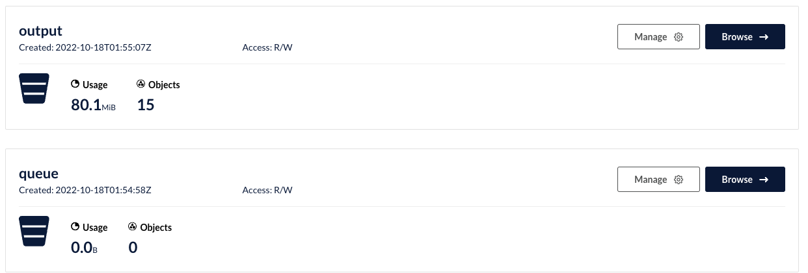

# Music Separation App

Music-Separation-as-a-service (MSaaS)

## Overview
Created a kubernetes cluster that provides a REST API for automatic music separation service and prepares the different tracks for retrieval.

You may [want to bookmark this kubernetes "cheat sheet"](https://kubernetes.io/docs/reference/kubectl/cheatsheet/).

Containers deployed provide the following services:
+ **rest** - the REST frontend will accept API requests for analysis and handle queries concerning MP3's. The REST worker will queue tasks to workers using `redis` queues.
+ **worker** - Worker nodes will receive work requests to analyze MP3's and cache results in a cloud object store (probably Min.io).
+ **redis** - a Redis deployment and service to provide a redis database server.

### Waveform Source Separation Analysis
The worker uses [open source waveform source separation analysis](https://github.com/facebookresearch/demucs) software from Facebook. Our reason for turning this into a micro-service is because it takes a long time to run the source separation (about 3-4x the running time of a song).

### Cloud object service

Rather than send the large MP3 files through Redis, I am using the Min.io object storage system (or other object store) to store the song contents ***and*** the output of the waveform separation. 

In my solution, I have a single 'bucket' called "queue" that holds the objects containing MP3 songs to process and another bucket called "output" to hold the results ready for download:

The "output" bucket has objects named `<songhash>-<track>.mp3` that contain the separate tracks of a song:

### Sample Data
Two programs `sample-requests.py` and `short-sample-requests.py` were produced that make some sample requests.
